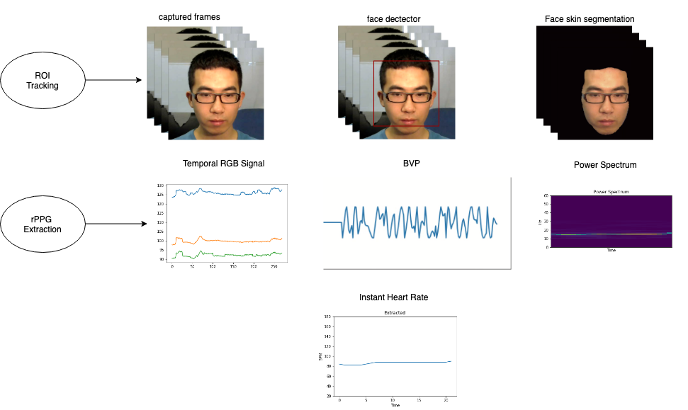

# Robust Heart rate estimation from facial videos

This repo monitors real time cardiac activities of a person through remote photoplethysmography(rPPG) without any physical contact with sensor, by detecing blood volume pulse induced subtle color changes from video stream through webcam sensor or a video file.

### Pre Processing 
Skin pixels play significant role in extraction of rPPG signal therefore, we trained first ever deep learning model for semantic 
segmentation of skin and non skin pixels. This is novel technique for region of interst (ROI) selection and tracking. The model is robust to motion, multiple postures and segments skin pixels from non skin very accurately.
rPPG signal exhibit different waveform when sampled from different rigions of skin, therefore, to consistently sample ROI from same part of skin we detect face as prerequisite step to semantic segmentation.

### rPPG Signal Extraction 
After detection and tracking ROI for signal extraction we compute the spatial red, green and blue channel mean of skin segmented pixels to minimise camera quantization error. Averaged values of RGB channel are temporally normalized and projected to plane orthogonal to skin-tone. The projected signal is alpha tuned to extract signal. 

### Post processing

We apply signal processing techniques, moving average filter of order 6 to remove outliers from signal. To estimate heart rate we compute power spectral density PSD applying fast fourier transformation (FFT) on rPPG signal. It is then band pass filtered to analyse only frequencies of interest. The maximum power spectrum represents the frequency of instant heart rate. 

This code runs on cuda enabled device at 30 FPS and estimates heartbeat in one second intervel.

## Pipeline

## Requirements

* Python 3
* Numpy
* Pytorch
* OpenCv
* Matplotlib, Scipy, Pillow
* Git Lfs to track trained model parameters or alternatively download the model from [google drive]( https://drive.google.com/open?id=1shRnrUAF5HyA_vwXJfCcrNVFkltT7U5E)

* We have used deep learning for semantic segmentation of skin and non skin pixels from frames. The segmentation requires cuda enabled device

Clone this repository.

        git clone https://github.com/nasir6/rPPG.git

To run

        cd rPPG
        python3 run.py --source=0 --frame-rate=25

